# voyant-project

Course: Introduction to the Digital Humanities 
Semester: Monsoon 2021 
Professor: Johannes Burgers 
Group: Aninthitha Nath, Sara Singh, Saravana Chilamakuri (Group 1) 
Project: Data Visualization with Voyant (Project 1) 
Date: 19/09/2021

## 
Canonicity in late 19th century literature: A study of Mark Twain and Rudyard Kipling

## Introduction
Canonicity in modern English literature determines one’s reading experience to a large extent. Box sets composed of classics, recommendations of famous books by 19th century authors, lists that consist of “books you must read before you die” are all some not so subtle examples of this property of a canon permeating into our everyday lives.
But, what is canon and who decides it? For the purposes of this report, we’ll be using literary critic Harold Bloom’s analysis on what makes the cut as a canonical piece of literature. Literary canon for Bloom is defined equally by the pieces in it and by those that exist out of it. Here is an evaluation made of these texts which has aesthetic, formal, and cultural bases (The Canonicity Project). Further down this report, we’ll also be making use of Joseph Campbell’s musings on canonicity to determine what makes certain works canonical for the authors that we’ve chosen.
This is precisely what we wish to explore with Twain and Kipling - what separates their canonical works from their other books? Are there any themes that feature more in these works with respect to the others? Are there any common features across these books that are amplified in their canonical works? All these are questions that our hypothesis aims to answer by analysing 2 canonical and established texts from each author against the rest of their works.

## Hypotheses
### Primary Hypothesis:
What separates canonical works of authors from the rest of their literature? Are the most famous works of an author the most representative of the common themes found in their writing?
### Secondary Hypothesis:
How much work of an author do you have to read to get a decent idea about them? Would their most famous works suffice, or is it necessary to go beyond that?
## Why Mark Twain and Rudyard Kipling?
For the purpose of this hypothesis, we chose Rudyard Kipling and Mark Twain as the primary subjects of our study. Both authors are widely celebrated and are part of what is considered to be the literary canon. They also happen to write about similar themes, such as courage, duty, friendship, etc. Within their corpora, we have decided to focus primarily on 2 books of each author: The Jungle Book and Kim for Kipling, and The Adventures of Huckleberry Finn and The Adventures of Tom Sawyer for Twain. The reason for choosing these books specifically is that they’re the most widely-read and discussed works of these authors, and thus are the most appropriate texts to focus our attention on.
## Methodology
With a simple google search we tried to find what people widely regard as the most common themes featured in Twain’s and Kipling’s work. Based on the themes we found, we tried to find synonyms for these words so that we could build a list of terms that might signify the same or similar themes throughout their work. After that, we did a frequency comparison, collocates, correlations, scatterplot, microsearch, documents and summary.
## Themes
### Mark Twain
* Bravery (brave*, adventur*, confident/confidently, courag*, fear*)
* Friendship (friend*, chum*, partner*)

### Rudyard Kipling
* Courage (courag*, dare/dared, brave*, fear*, hero*)
* Duty (duty*/duti*, burden*, job*, work*, ought*)

## Frequency
The frequency tool has been used to assess two things:
1. How the common themes of popular and canonical fiction appear in the works of Kipling and Twain, understood by means of applying Joseph Campbell’s idea of the ‘Hero’s Journey’.
2. How well-represented the common themes specific to Kipling’s and Twain’s work are in their most popular texts.

Together, these two questions help us understand why certain works of Kipling’s and Twain’s achieved canonical status, and whether reading just these works of theirs is enough to get a grasp on the breadth of their published work.

### Why canon?
To assess the corpora for canonicity, we employed Joseph Campbell’s idea of the ‘Hero’s Journey’ as a framework to understand the various kinds of themes that surface in popular and canonical works often. The ‘Hero’s Journey’ trope follows a main character who is put through multiple trials and tribulations and eventually comes out stronger after having gone through an adventure or transformative experience of some kind. From this, we inferred that the general themes that feature in any story that employs this trope are broadly those of courage, bravery, and fear.

For the purposes of understanding the frequency of these themes in Kipling’s and Twain’s work, a word cluster was created for all three themes. 
To understand courage, we created a cluster that contained the terms <em>courage*, dare, dared, brave*,</em> and <em>hero*</em>.
To understand bravery, we created a cluster that contained the terms <em>brave*, adventur*, confident</em>, and <em>confidently</em>.
Finally, to understand fear, we created a cluster that contained the terms <em>fear*, scare*</em>, and <em>hesitant*</em>.

### Kipling
In Kipling’s corpus, the popular and canonical works of his that we paid attention to were <em>The Jungle Book</em> (1894) [number 12 on all frequency graphs] and <em>Kim</em> (1901) [number 21 on all frequency graphs].

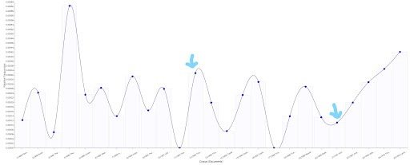

<em>Graph 1</em>

In this figure, the terms chosen for the theme of courage are mentioned a total of 349 times throughout the corpus, with a frequency of 0.0003286 for <em>The Jungle Book</em> and a frequency of 0.0001116 for <em>Kim</em>. In terms of relative frequency, <em>The Jungle Book</em> seems to fall somewhere right in the middle, whereas <em>Kim</em> features a low amount of words we chose to associate with courage.

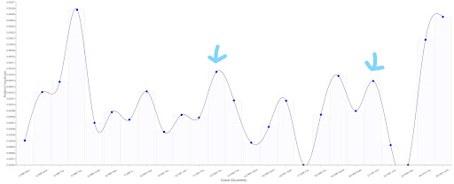

<em>Graph 2</em>

For the theme of bravery, the terms we chose appear a total of 163 times throughout the corpus. The frequency of the terms we chose to represent bravery in these texts is nearly the same, and both <em>The Jungle Book</em> (f = 0.0001546) and <em>Kim</em> (f = 0.0001395) fall in the middle of the relative frequency chart.

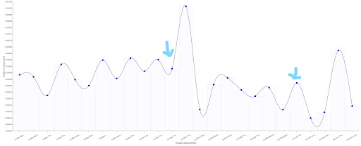

<em>Graph 3</em>

As for fear, the terms associated with the theme are mentioned a total of 627 times throughout the corpus. Once again, <em>The Jungle Book</em> (f = 0.0004832) and <em>Kim</em> (f= 0.0003720) aren’t far apart in frequency, and both seem to fall somewhere in the middle when compared to the rest of the corpus.
### Mark Twain
In Twain’s corpus, the two popular and canonical texts we chose were <em>The Adventures of Huckleberry Finn</em> (1884) [number 5 on all frequency graphs] and <em>The Adventures of Tom Sawyer</em> (1876) [number 25 on all frequency graphs]. The graph above shows the frequency of terms we associated with the theme of courage, wherein these terms have been mentioned a total of 469 times in the corpus. In this, <em>Huckleberry Finn</em> (f = 0.0000944) has a significantly lower amount of terms related to courage, whereas <em>Tom Sawyer</em> (f = 0.0002917) has a much higher frequency of terms associated with courage, and seems to fall around the median of the corpus.

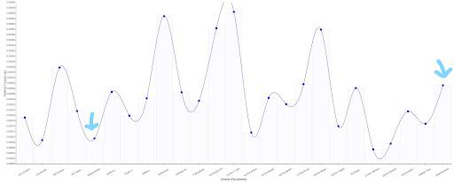

<em>Graph 4</em>

This trend repeats for the theme of bravery (terms mentioned 419 times throughout the corpus), with <em>Huckleberry Finn</em> (f = 0.0001459) featuring a much lower frequency of bravery-related terms compared to <em>Tom Sawyer</em> (f = 0.0004509).

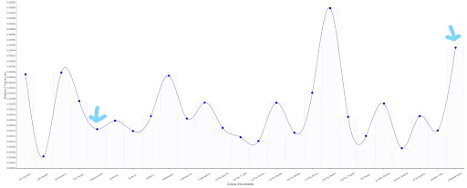

<em>Graph 5</em>

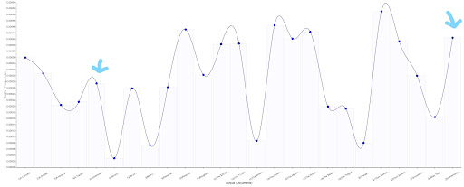

<em>Graph 6</em>

Fear-related terms have been mentioned a total of 577 times in the Twain corpus. In this, once again <em>Huckleberry Finn</em> (f = 0.0002746) features fewer terms than <em>Tom Sawyer</em> (f = 0.0004243), however the frequency is not insignificant in either text this time.
### Can One Represent the Whole?
In this section, we tried to look at the common themes specific to the corpora of Kipling and Twain and check for how well-represented these themes are in their canonical works.

For Kipling, we found that people largely find themes of courage and duty feature most commonly in his work, and for Twain, the common themes are bravery and friendship.
### Rudyard Kipling
Once again, we created word clusters for the same, with the cluster for courage consisting of <em>courag*, dare/dared, brave*, fear*</em>, and <em>hero*</em>
The cluster for duty was <em>duty*/duti*, burden*, job*, work*</em>, and <em>ought*</em>.

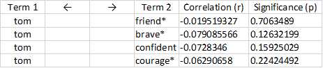

<em>Graph 7</em>

In this frequency graph, we find that courage-related terms have been mentioned a total of 910 times in the corpus, and the frequency of these terms is 0.0007151 for <em>The Jungle Book</em> and 0.0004744 for <em>Kim</em>. We find that the theme of courage is well-represented in both texts, but <em>The Jungle Book</em> relies on this theme a lot more than <em>Kim</em>.

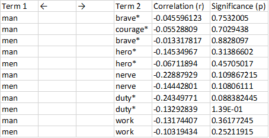

<em>Graph 8</em>

As for the theme of duty, the terms associated with it have been mentioned a total of 1969 times in the corpus. The frequency is 0.0005605 for <em>The Jungle Book</em> and 0.0006418 for <em>Kim</em>. It is interesting to note that both texts are among the least representative of the theme of duty.
### Mark Twain
For Twain’s corpus, we looked into the themes of bravery and friendship.
The word cluster for bravery was <em>brave*, adventur*, confident/confidently, courag*</em>, and <em>fear*</em>. 
The word cluster we used for friendship was <em>friend*, chum*</em>, and <em>partner*</em>.

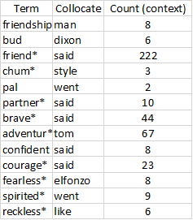

<em>Graph 9</em>

In this, bravery-related terms were mentioned a total of 752 times in the corpus, with the frequency being 0.0001716 for <em>Adventures of Huckleberry Finn</em> and 0.0006100 for <em>Adventures of Tom Sawyer</em>. It is clear that <em>Tom Sawyer</em. is much more representative of bravery compared to <em>Huckleberry Finn</em>.

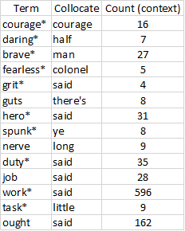

<em>Graph 10</em>

In this corpus, friendship-related terms are mentioned a total of 1099 times. The frequency of these terms is 0.0003518 in <em>Adventures of Huckleberry Finn</em> and 0.0003846 in <em>Adventures of Tom Sawyer</em>, with both texts being almost equally representative of the theme of friendship.
## Correlations
Click <a src='https://docs.google.com/spreadsheets/d/18OWsRcEm9uoc3qWyrfeShEEoaAP8aODEngmQEbfadI0/edit?usp=sharing'>here</a> for the data
Coverage was set at a minimum of 50% and correlations were seen for each of the two themes for each author. The synonyms were inputted into Voyant and the following spreadsheet full of correlations and significant values was extracted. In this section, we’d like to focus on the interesting correlations that were observed. 
For the theme friendship in Twain, the word “Tom” had a correlation of -0.01952 and a significant value of 0.706349. This of course, comes as no surprise as <em>The Adventures of Tom Sawyer</em> is one of the books considered canonical by us for this project. Furthermore, the second canonical book <em>Adventures of Huckleberry Finn</em> was said to be an indirect sequel to the <em>Tom Sawyer</em> books, and both employ the use of the same narrator. Thus, the presence of <em>Tom</em> correlating with the theme of friendship comes as no surprise as the friendship between these two young boys is a central thread across both of Twain’s canonical works.  Table 1 displays the correlation the name “Tom” had with the words associated with Twain’s overarching themes

<em>Table 1</em>

In Kipling, we immediately noticed the repetition of the term “man” in multiple correlations. Kipling’s themes of courage and duty are abstract concepts until applied to an entity, which in Kipling’s case almost always takes the form of mankind, or it’s anthropomorphised version. Both Kim and Jungle Book, his two most famous works, focus on how man navigates “exotic” environments while enacting and embodying the ideals of courage and duty.

<em>Table 2</em>

## Collocates
Click <a src="https://docs.google.com/spreadsheets/d/1ZKtiUBoon_GZDlcDJc1lB7sXiYyNJHMtv-TsAgz3Gj4/edit?usp=sharing">here</a> for Mark Twain data
Table 3 showcases the highest collocates for each respective theme. As was the trend with correlations, we can observe some names that have snuck their way into the collocation list - with Dixon, Elfonzo, and Tom. Om in this scenario is not indicative as <em>Adventures of Tom Sawyer</em> is the name of the book and despite removing all the metadata from the Project Gutenberg version, the name if the book precedes chapter titles on certain pages and thus “Tom” is the highest occurring collocate corresponding to <em>adventur*</em>

<em>Table 3</em>

Click <a src="https://docs.google.com/spreadsheets/d/1_L1KEI9Kq9MF9FWs7Bqh25Bt3ldAN_jVPYqu4i_OkcM/edit?usp=sharing">here</a> for Rudyard Kipling data.
Table 4 here shows the collocates with the highest count for the themes of courage and duty observed throughout Kipling. Unlike the analysis on Twain, this tied in neatly with the correlations analysis as the word “man” featured as a fairly high collocate in a number of the words chosen as synonyms. His is showcased in table 5 and supplements the correlations analysis nicely, in a way that we weren’t able to conclusively do with Twain’s works.

<em>Table 4</em>

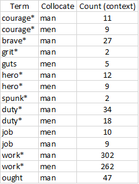

<em>Table 5</em>

Correlations, as discussed in class, can be quite gimmicky and thus we’re not entirely sure how useful the correlation analysis is for this project, but nonetheless it provides a useful preliminary insight with which we can dive into the corpus further. With respect to what differentiates the canonical works from the rest of the corpus, the central themes associated with Twain correlate significantly with the name of his main character Tom Sawyer.

For collocations, there is a direct connection that can be made for Kipling’s works, as the word “man” directly correlates with his main themes, and the word “man” also features high up in the collocates list. Thus, we can get a direct link between the main characters/actors (so to speak) from each of these two authors' canonical works, and their main themes, that is significant enough to be separated from the rest of the corpus. As for the secondary hypotheses, the analysis on the basis of correlations and collocates was inconclusive as there wasn’t enough information to suggest whether these two books, while significant in their themes, hold more of these themes than the corpus collectively. The frequency tool would be a much better indicator to support or reject the secondary hypothesis. 

## Third Tool(s)
### Mark Twain
1. From the documents tool, we found that 6 books are longer than <em>The Adventures of Huckleberry Finn</em> and 9 books are longer than <em>The Adventures of Tom Sawyer</em> in this collection of 25 texts. This may be indicating that for a text to be famous, it should neither be too short, nor should it be too long.

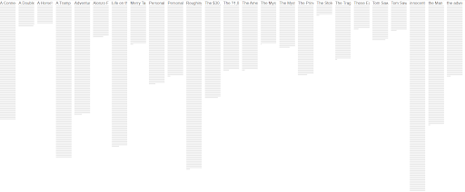

<em>Graph 11</em>

2. From the documents tool, we found that only 7 books have fewer words/sentence ratio than <em>The Adventures of Huckleberry Finn</em> (19 words/sentence) and <em>The Adventures of Tom Sawyer</em> has the least words/sentence ratio in the entire Mark Twain corpus (15.5 words/sentence) while the average is 20 words/sentence in this corpus. This may be indicative of the readability of the text in that if there are less number of words per sentence, it becomes easier to read which gives the text a greater chance to be likeable.
3. From the summary tool, we found that <em>The Adventures of Huckleberry Finn</em> has the lowest vocabulary density (0.061) among all the texts in this corpus. Similarly, <em>The Adventures of Tom Sawyer</em> also has a significantly low vocabulary density (0.105). On the other hand, the highest vocabulary density in this corpus is 0.232. This suggests that if the text has low vocabulary density, it has a greater chance of being readable and in turn, a greater chance of being liked by more people

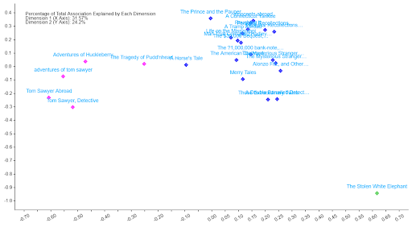

<em>Graph 12</em>

This is the scatter plot tool. We set the options such that it provides the information regarding the similarity of the documents. Notice that <em>The Adventure of Huckleberry</em>, <em>The Adventure of Tom Sawyer</em> and the other two <em>Tom Sawyer</em> books are fairly similar whereas all others are similar in that they are all in a dense cluster with the exception of <em>The Stolen White Elephant</em> which is both the shortest and the text with the highest vocabulary density (0.232). This suggests that there is a significant difference between Mark Twain’s famous work in comparison to the remaining texts.
### Rudyard Kipling
1. From the documents tool, we found that 10 books are longer than <em>The Jungle Book</em> in this collection of 26 texts, further supplementing the evidence for the argument

<em>Graph 13</em>

2. From the summary tool, we found that only 2 books have lower vocabulary density than <em>The Jungle Book</em> in this corpus. On the other hand, the highest vocabulary density in this corpus is 0.279. The second book with lower vocabular density than <em>The Jungle Book</em> is in fact <em>The Second Jungle Book</em>. This suggests that if the text has low vocabulary density, it has a greater chance of being readable and in turn, a greater chance of being liked by more people

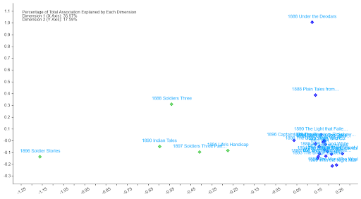

<em>Graph 14</em>

This is the scatter plot tool. We set the options such that it provides the information regarding the similarity of the documents. <em>The Jungle Book</em> is in fact in the cluster itself. This suggests that there is no significant difference between Rudyard Kipling’s famous work in comparison to the rest of texts or that voyant is unable to detect the difference.
## Limitations and Confounders
While using the frequency tool for an assessment of themes in a text, a number of confounders surfaced. The most obvious one being that a simple mention of a term isn’t enough to classify it as a significant thematic presence in a novel. However, given the themes we were analyzing (courage, bravery, fear, duty, etc.), we find that more often than not they are used as adverbs (thus describing characters’ actions and creating imagery) and act as important terms to set the tone of any scene. However, it must also be noted that a lack of words that represent these themes in a novel isn’t a good indication of the lack of that theme in itself. The author may have chosen to write something purely allegorically, or perhaps the word cluster created just isn’t an adequate representation of the lexicon they employ for depicting themes of courage, bravery and fear.

This leads us to an obvious limitation, one of personal implicit bias while choosing not only the canonical texts for the project, but also the overarching themes and the synonyms chosen. A lot of the corpus selection comes down to personal choice, and while the group has aimed to back up each one of these choices with academic, and literary sources, the fact remains that there is a confounder right at the beginning - the selection of the corpus itself.

Another limitation that we encountered especially in the correlations and collocates tool is the presence of the words occurring in the book title, and the same word being repeated. For instance, the highest collocated for courage in the Kipling corpus was also courage with a collocate count of 16. We’re unsure of whether this was a glitch or an indicator of repeated words being used as writing style for dialogues.
## Conclusion
From the use of the frequency tool, we found that popular themes found in canonical works are, in fact, well-represented in the most popular texts of both Kipling and Twain, and this holds especially true for The Jungle Book and <em>The Adventures of Tom Sawyer</em>. However, despite these themes being ‘well-represented’ in these texts, they are by no means the most represented in these texts. Many works of both Kipling and Twain far surpass the frequency of these themes and terms we found in their popular and canon texts, and yet these texts are not the ones that are heralded as part of any great literary canon. From this we can infer that it is clearly not enough to have certain thematic elements in a text to have it be successfully received by the masses, there are several other elements that add canonical value to a text.

As for the second question we set out to answer — of whether Kipling’s and Twain’s most popular works are most representative of their most commonly used themes — the answer is no. Even though our research told us that Kipling writes about themes of duty often, this was a very under-represented theme in both of his famous novels. Thus, we may also conclude that simply reading their most famous texts will not be enough to understand every single theme the authors like to explore throughout their work.

Another general trend we have noticed in terms of book length is that for a book to be famous, it should neither be too short nor too long. Books with low vocabulary density and low words/sentence ratio also seem to have a greater chance of being read by a larger audience for longer periods of time, making those texts the author’s canonical works.
## Experience using Voyant
Voyant has proven to be useful in analyzing large amounts of textual data using numerical and visual tools. The number of tools provided by Voyant and the speed with which it gives the results required is truly commendable. However, the tool has a significant amount of bugs. For instance, the sorting does not happen as expected.

While analyzing the collocates, the entire list of words keeps repeating an arbitrary number of times, mostly stopping at 5 whole repetitions. This was significantly challenging to export as we had to manually delete the reparations, as is reflected in the attached excel sheet with the data. 

All in all, as long as we know the pros and cons of the underlying logic with any tool, the tool is extremely handy in analyzing large corpuses of data quickly.

## References
1. <em>The Canonicity Project</em>, canonicity.github.io/#page-top
2. Harris, Wendell V. “Canonicity.” PMLA, vol. 106, no. 1, Modern Language Association, 1991, pp. 110–21, https://doi.org/10.2307/462827
3. “Writing 101: What Is the Hero's Journey? 2 Hero's Journey Examples in Film - 2021.” MasterClass, www.masterclass.com/articles/writing-101-what-is-the-heros-journey#joseph-campbell-and-the-heros-journey