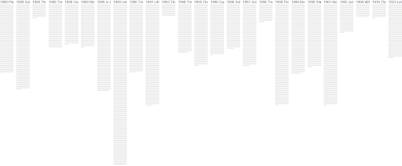

# voyant-project

Course: Introduction to the Digital Humanities 
Semester: Monsoon 2021 
Professor: Johannes Burgers 
Group: Aninthitha Nath, Sara Singh, Saravana Chilamakuri (Group 1) 
Project: Data Visualization with Voyant (Project 1) 

## 
Canonicity in late 19th century literature: A study of Mark Twain and Rudyard Kipling

## Introduction

